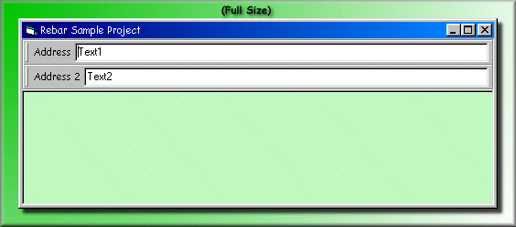



## ReBar \(Internet Explorer \- Like Toolbar\) in VB

### Description

This is a class module that allows a "Rebar", or an Internet Explorer style toolbar to be made. It subclasses the Rebar and can trigger events when the rebar is moved, resized, clicked, mouse moved, and a lot more. The rebar can hold any VB control, even UserControls. THIS IS NOT MY CODE! I am simply passing Ramon's code, which can be found at www.zonecorp.com His code made this sample possible! You can e-mail Ramon at Ramon@Zonecorp.com
 
### More Info
 
The subclassing will crash VB if you try to stop the project without using the close button. In other words, if your project goes into break mode because of an error, VB will crash. This can be fixed by commenting out the "subclass me.hwnd" line in the Form_Load procedure. However, without this line your project won't recieve events.

             |
---                |---
**Submitted On**   |2000-01-09 22:17:46
**By**             |[Brian](https://github.com/Planet-Source-Code/PSCIndex/blob/master/ByAuthor/brian.md)
**Level**          |Advanced
**User Rating**    |5.0 (15 globes from 3 users)
**Compatibility**  |VB 5\.0, VB 6\.0
**Category**       |[Custom Controls/ Forms/  Menus](https://github.com/Planet-Source-Code/PSCIndex/blob/master/ByCategory/custom-controls-forms-menus__1-4.md)
**World**          |[Visual Basic](https://github.com/Planet-Source-Code/PSCIndex/blob/master/ByWorld/visual-basic.md)
**Archive File**   |[CODE\_UPLOAD2801192000\.zip](https://github.com/Planet-Source-Code/brian-rebar-internet-explorer-like-toolbar-in-vb__1-5397/archive/master.zip)

### API Declarations

Are you kidding? This thing has more API calls that Bill Clinton has girlfriends :-)

